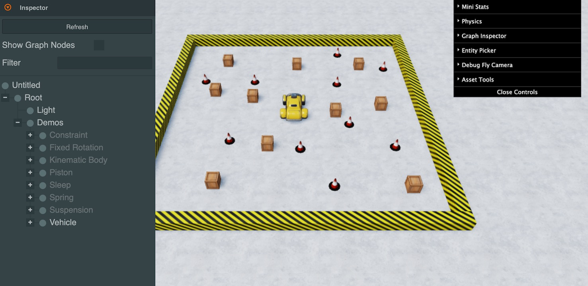
# How to add to a PlayCanvas App

The easiest way is to add a bookmarklet to the browser. It's the same as a bookmark but instead of a URL, you have executable JS code instead.

Create a bookmarklet by making a new bookmark and changing URL to the following:
```
javascript:(function(){var a=document.createElement('script');a.src='https://yaustar.github.io/playcanvas-devtools/injector.js';document.head.appendChild(a);})();
```

More detailed instructions on how to create a bookmarklet can be [found here](https://mreidsma.github.io/bookmarklets/installing.html).

## As part of a project

If you would like to have this as a 'allows on' feature of your PlayCanvas project, you can create a new script file in the project and have it's contents as follows:

```
(function(){
    var a = document.createElement('script');
    a.src = 'https://yaustar.github.io/playcanvas-devtools/injector.js';
    document.head.appendChild(a);
})();
```

# Available tools

## Mini Stats
Shows the CPU, GPU and total frame time in ms. Can be enabled/disabled via the menu.

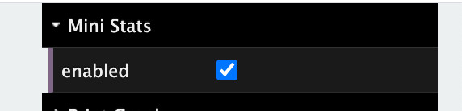

## Physics debug renderer
Render physics volumes in the scene. Requires the script to be added to the scene first by clicking on `addPhysicsDebug`.

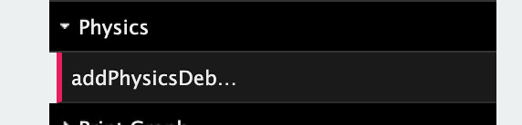
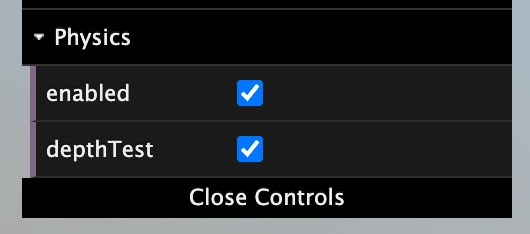

## Graph Inspector
This will show a treeview of the current hierarchy in the scene and also allows you to inspect entities in the browser's devtools console.

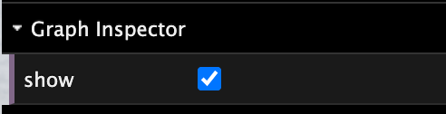

`Refresh` button updates the tree view to the current state of the scene.
`Show Graph Nodes` tickbox will also show graph nodes in the tree view when `Refresh` is pressed.
`Filter` allows you to add use the conditional in the filterString to print out where `node` represents the node to filter.

e.g.
Set the `Filter` to `node.model` will show all the nodes that were in the tree view that has a model component.

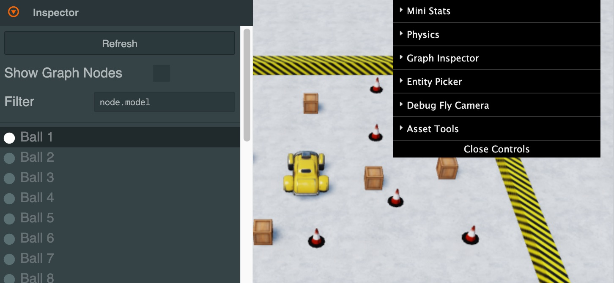

Selecting any node in the tree view will print out the object in the console and assign a global variable `_selectedNode` to it. This allows you to call functions, change properties etc in the console.

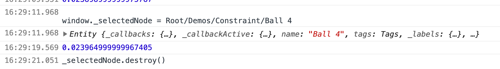

## Entity picker
Allows you to middle click or touch on any object in the scene and print the details to the console. Useful for finding where entities are in the hierarchy and investigating the current prosperities on said entity. The hierarchy path is also printed to make easier to directly modify the entity on the console.

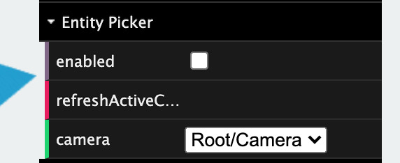


The camera list should be set to camera that is used for the current view.


## Debug Fly Camera

When enabled, you can control the selected camera in the dropdown with an attached gamepad or mouse and keyboardto fly around the scene. It's not 100% perfect and has only be tested with a X360 controller but works well enough for most applications.

In the case where the application uses a controller, you can select with gamepad to use (`gamepadIndex`) when you have multiple connected.

The script also detaches the mouse and keyboard controls from the app. While the camera is enabled, you will not be able to interact with your app.

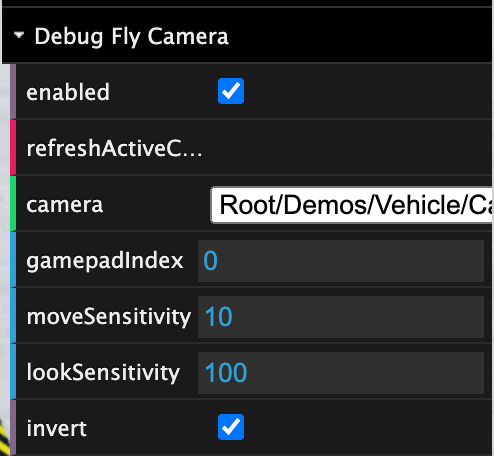

### Controls (X360 controller)

* Left analogue stick - move forward/back and strafe left/right
* Right analogue stick - look up/down/left/right
* Dpad - change sensitivity for moving and looking
* A Button - toggle look up/down invert
* Left/Right shoulder triggers - pan up/down
* Start - toggle timescale from 0 to the value it was when the fly camera is enabled

### Controls (Keyboard)

* WASD - move forward/back and strafe left/right
* Mouse with right mouse button held - look up/down/left/right
* Cursor arrows - change sensitivity for moving and looking
* I - toggle look up/down invert
* QE - pan up/down
* P - toggle timescale from 0 to the value it was when the fly camera is enabled


## Asset Tools

Quick buttons to list all the assets that are preloaded or not preloaded in the console. Also creates a regex that can be used in the Editor assets panel to filter those assets.

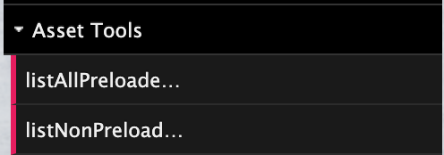
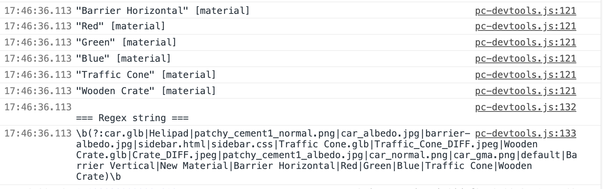


# Tool authors

* dataarts's dat.gui [Apache 2.0](https://github.com/dataarts/dat.gui/blob/master/LICENSE)
* PlayCanvas Will's Debug physics renderer [MIT](https://github.com/playcanvas/engine/blob/master/LICENSE)
* PlayCanvas Donovan's ministats [MIT](https://github.com/playcanvas/engine/blob/master/LICENSE)
* PlayCanvas PCUI [MIT](https://github.com/playcanvas/engine/blob/master/LICENSE)
