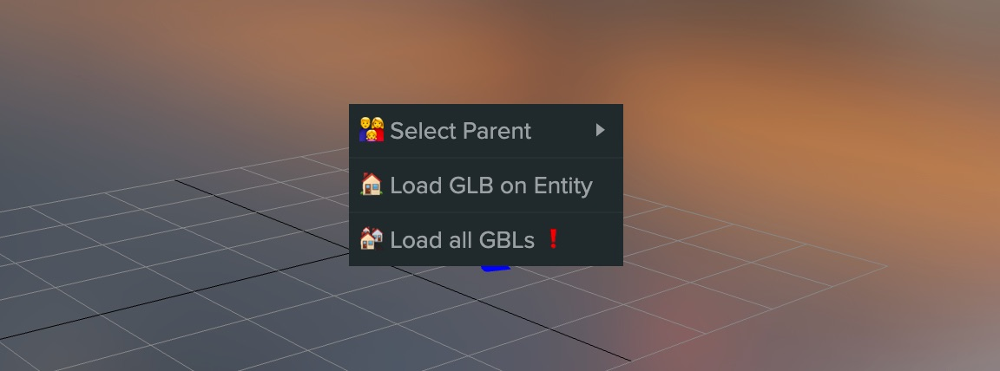
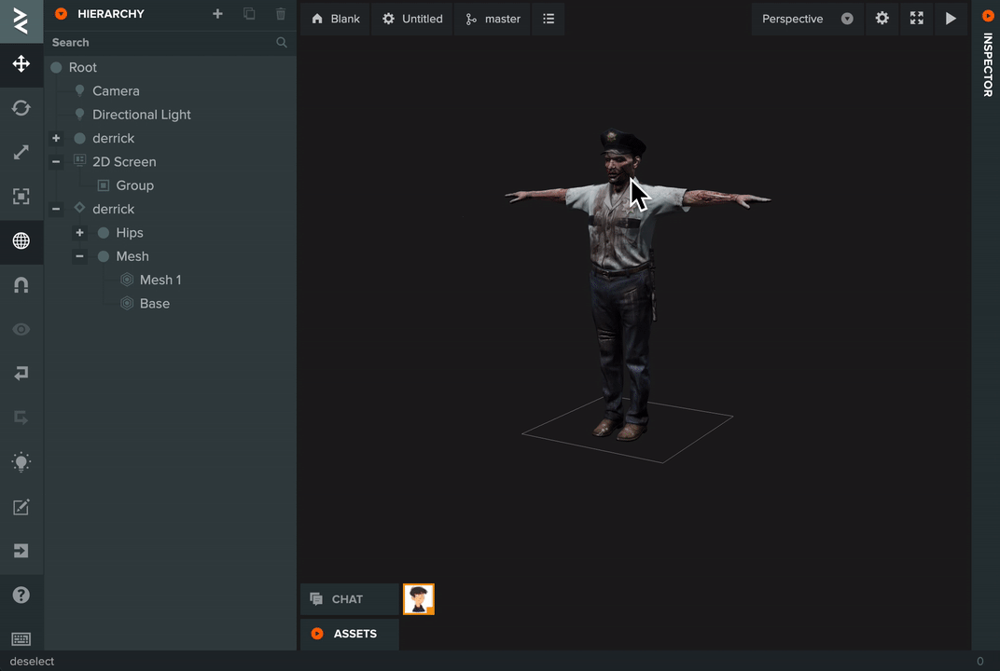
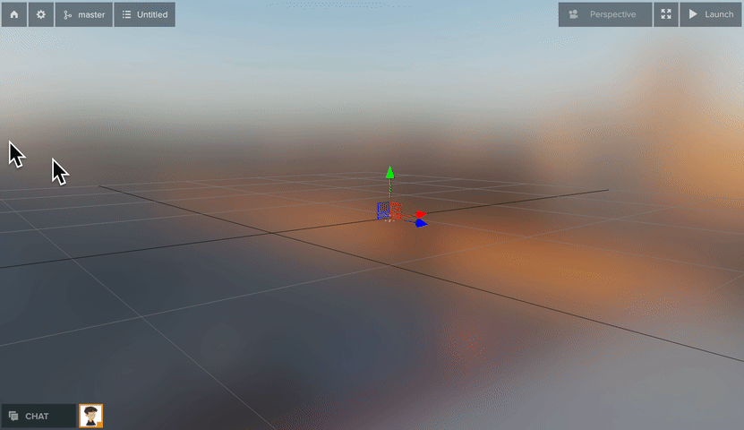
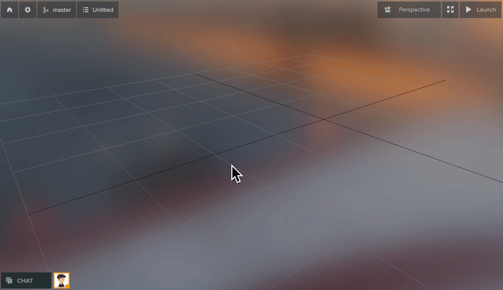

# yaustar PlayCanvas Editor Tools

## Introduction

These scripts are a toolset that allows you to use Editor Plugin scripts in the project that uses the [PlayCanvas Editor API](https://github.com/playcanvas/editor-api) for extra functionality.

This allows you to create and develop plugins directly in the PlayCanvas Editor.

**Please note**: This is not an official PlayCanvas feature and subject to change. This process may be replaced when PlayCanvas adds Editor Plugin support.

Assuming you are using Chrome:

1. Install Violent Monkey Chrome extension: https://violentmonkey.github.io/
2. Open the URL to install the core script:
    - https://yaustar.github.io/playcanvas-editor-api-tools/editor-utils.user.js
3. Optional scripts that can be added to Violent Monkey or be added to specific projects as Plugins:
    - https://yaustar.github.io/playcanvas-editor-api-tools/glb-utils.user.js ([Docs](#load-glb-for-selected-entity))
    - https://yaustar.github.io/playcanvas-editor-api-tools/projected-skybox.user.js ([Docs](#projected-skybox))
    - https://yaustar.github.io/playcanvas-editor-api-tools/code-editor-utils.user.js (Adds Editor API type definitions in the Code Editor)
4. Done!

To write your own plugin:

1. Create a script in the assets panel
2. Tag it with `editor`
3. Tick 'Exclude' so that it isn't used when launching the app or publishing
4. Add Editor API code to extend the Editor (example below)
5. Refresh the Editor tab
6. For security, when Editor Plugin scripts are found, we ask the user if they want to load them. 'Don't ask again' will store the setting in the browser's local storage under the key `yauEditorTools` and `approvedProjects` property.

https://user-images.githubusercontent.com/16639049/212740036-904c17c7-6a53-445d-b891-c0c088ae3baa.mp4

Example Editor Plugin to generate boxes
```javascript
(function() {
    async function generateBoxes(count, position, radius) {
        // create box entity
        const box = editor.entities.create({ parent: editor.entities.root });
        // add render component
        box.addComponent('render', {
            type: 'box'
        });

        // add a number of boxes around a point in the scene
        let offset = new pc.Vec3();
        let rotation = new pc.Quat();
        const result = [];

        for (let i = 0; i < count; i++) {
            const boxCopy = await box.duplicate();
            boxCopy.set('name', 'Box ' + (i + 1));
            offset.set(1, 0, 0);
            rotation.setFromEulerAngles(0, pc.math.random(-360, 360), 0);
            offset = rotation.transformVector(offset);
            offset.scale(pc.math.random(-radius, radius));
            boxCopy.set('position', [position.x + offset.x, position.y + offset.y, position.z + offset.z]);

            result.push(boxCopy);
        }

        // delete original box
        box.delete();

        return result;
    }

    function createButton() {
        const btn = new pcui.Button({ text: 'Generate Boxes' });
        btn.style.position = 'absolute';
        btn.style.bottom = '10px';
        btn.style.right = '10px';
        editor.call('layout.viewport').append(btn);

        let boxes;

        btn.on('click', () => {
            // delete existing boxes
            if (boxes) {
                editor.entities.delete(boxes);
                boxes = null;
            }

            generateBoxes(10, new pc.Vec3(), 10).then(result => {
                boxes = result;
            });
        });
    }

    createButton();
})();
```

## Tools

### In Editor

A right click context menu in the 3D viewport



#### Hierarchy Menu

A context menu in the 3D viewport to make it easier to select entities in the viewport, especially if the render mesh is a child of the entity that has the physics collision and/or logic.

Right clicking on the viewport when one entity is selected will give a list of the selected entity parents. Clicking on any of these entries will select that entity.



#### Load GLB for selected Entity

Requires `editor-utils.user.js` to be installed.

This loads the GLB model for the current selected Entity to allow you to see it at Editor time.

It doesn't add it to hierarchy in the Editor and therefore, you can't select it, modify it etc.

Explicitly designed to be used with the scripts in the [Load GLB project example](https://developer.playcanvas.com/en/tutorials/loading-gltf-glbs/).



#### Load all GLBs in the scene

Same restrictions as 'Load GLB for selected Entity' but does it for all the Entities in the scene. Warning: Can be slow on large scenes as it has to go through every Entity.



#### Projected Skybox

Requires `editor-utils.user.js` to be installed.

This is an additional script to be used with the following project: https://playcanvas.com/project/985028/overview/projective-skybox

The project projects the skybox onto geometry creating a more 'grounded' and realistic look to the scene via a custom shader.

The option is only available when the entity that has the script `project-skybox-chunks.js` attached is selected.


